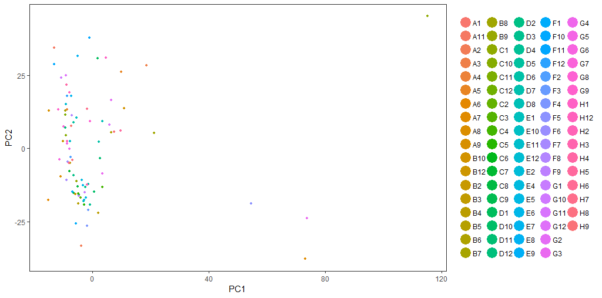
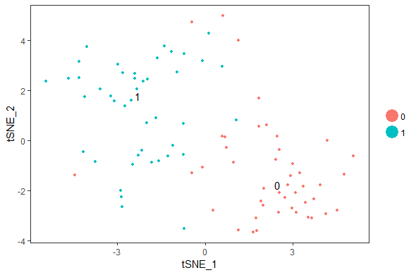
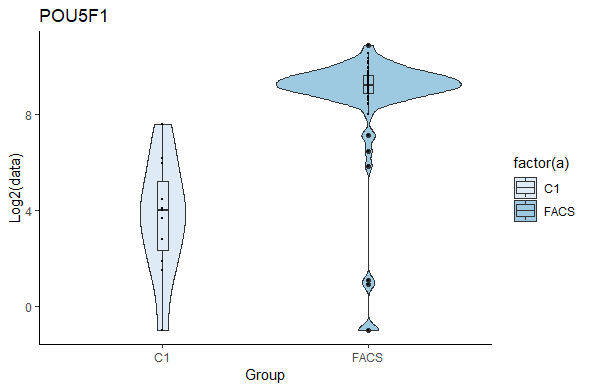
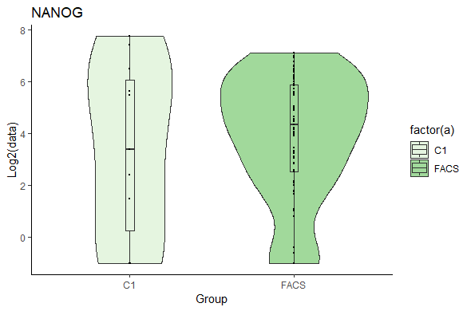
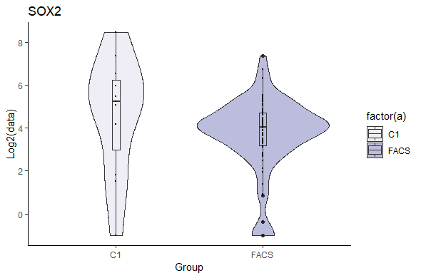

Final Project
=============

##The goal of my final project is to generate a gene matrix TPM text file with genes as rows and columns as cells. I generated this file using awk from 88 single cell RSEM output files. 

###awk script to take all files in the current directory with the individual_cell_name_rsem.genes.results and place column 6 (TPM) into a matrix with a header made from the individual file names and row names are genes

```bash
awk -F "\t" 'BEGIN {printf "gene"; for (i=1; i<ARGC;i++)printf "\t" ARGV[i]; printf "\n" } {if (x[FNR]) {x[FNR] = sprintf("%s\t%s", x[FNR], $6)} else {x[FNR] = sprintf("%s%s\t%s",x[FNR],$1,$6)}}  END {for (i=1;i<=FNR;++i) print x[i]}' *_rsem.genes.results > final_matrix.txt
```
#output:
```
head final_matrix.txt | less -S

```
Output:

gene    A11_S11_rsem.genes.results      A1_S1_rsem.genes.results        A2_S2_rsem.genes.results        A3_S3_rsem.genes.results        A4_S2_rsem.genes.result
ENSG00000000003.14      0.00    167.43  56.45   0.00    12.43   0.00    39.06   129.35  34.94   6.04    40.76   82.66   0.00    65.24   88.31   156.17  97.71
ENSG00000000005.5       0.00    0.00    0.00    0.00    9.90    0.00    0.00    0.00    11.76   0.00    0.00    8.94    0.00    0.00    0.00    23.68   0.00
ENSG00000000419.12      0.00    57.70   116.06  0.00    109.99  0.00    64.33   5.73    30.35   29.17   0.00    120.22  0.00    32.01   155.11  137.24  37.32
ENSG00000000457.13      0.00    0.00    0.00    0.00    0.00    0.00    0.00    0.77    1.78    0.00    0.00    0.00    0.00    0.00    0.00    0.00    8.15
ENSG00000000460.16      0.00    0.00    11.04   0.00    0.00    0.00    1.14    9.60    0.00    0.00    0.00    3.56    0.00    0.74    0.00    2.59    7.13
ENSG00000000938.12      0.00    0.00    0.00    0.00    0.00    0.00    0.00    0.00    0.00    0.00    0.00    0.00    0.00    0.00    0.00    0.00    0.00
ENSG00000000971.15      0.00    0.00    0.00    0.00    0.00    0.00    0.00    0.00    0.00    0.00    0.00    0.00    0.00    0.00    0.00    0.00    0.00
ENSG00000001036.13      27.87   25.29   52.41   0.00    12.14   0.00    73.01   50.82   57.19   13.43   35.25   89.61   0.00    95.59   47.64   55.83   35.76
ENSG00000001084.10      0.00    25.38   0.00    0.00    0.00    0.00    28.77   0.00    17.65   0.00    6.27    13.95   0.00    4.24    0.00    0.00    1.65


###The BEGIN part of the awk script places the header where ARGC and ARGV are the file names in the current direcotry name_rsem.genes.results.  The next part of the awk command is the IF/ELSE statement which takes the current line FNR of each input file and matches it with the contents of column 6 for the 2nd to the nth file.  The ELSE statement does this for the first file and prints the gene names in the first column.  END prints the information in the output file final_matrix.txt file.

Writing R tSNE:
--------------
##I input the final_matrix.txt file into R and used the R package Seurat to make a few plots. I include the output of the main plots generated from this R script in either .pdf format or as imbedded .png's (see below)

```
#Seurat tsne
#library(devtools)
#install.packages('Seurat')
#install.packages("ggplot2")
library(ggplot2)
library(Seurat) # version 2.3.4
#devtools::install_github("tidyverse/ggplot2")
# The easiest way to get ggplot2 is to install the whole tidyverse:
#install.packages("tidyverse") # This way worked, must have tidyverse for ggplot2, which is needed for Seurat to install properly
library(dplyr)
library(Matrix)
```
```
setwd("D:/DATA/UC Irvine/JJEMERSON_CLASS_2018")
data <- read.table("final_matrix.txt",header = TRUE, row.names ="gene")
rnames <- rownames(data)
mat_data <- data.matrix(data[,1:ncol(data)])
data_create <- CreateSeuratObject(raw.data = mat_data, min.cells = 3, min.genes =2000)
data_create <- NormalizeData(object = data_create, normalization.method = "LogNormalize", 
                             scale.factor = 10000)
length(data_create)

#filtered mitochondrial reads out of matrix already, so dont need to look at # mito reads
#mito.genes <- grep(pattern = "^MT-", x = rownames(x = data_create@data), value = TRUE)
#percent.mito <- Matrix::colSums(data_create@raw.data[mito.genes, ])/Matrix::colSums(data_create@raw.data)
#data_create <- AddMetaData(object=data_create, metadata= percent.mito, col.name="percent.mito")
#VlnPlot(object = plot, features.plot = c("nGene","nUMI","percent.mito"), nCol = 3)
data_create <- FindVariableGenes(object = data_create, mean.function = ExpMean, dispersion.function = LogVMR, 
                                 x.low.cutoff = 0.0125, x.high.cutoff = 3, y.cutoff = 0.5)
data_create <- ScaleData(object = data_create)
length(data_create@var.genes)

data_create <- RunPCA(object = data_create, pc.genes = data_create@var.genes, pcs.compute = 20, do.print = TRUE, pcs.print = 1:5, 
                      genes.print = 5)
```
```

PCAPlot(object = data_create, dim.1 = 1, dim.2 = 2)

#PCAPlot(object = Normalize, dim.1 = 1, dim.2 = 2) 

data_create <- JackStraw(object = data_create, num.replicate = 100, display.progress = FALSE)
JackStrawPlot(object = data_create, PCs = 1:13)
PCElbowPlot(object =  data_create)
data_create <- FindClusters(object = data_create, reduction.type = "pca", dims.use = 1:10, 
                            resolution = 0.6, print.output = 0, save.SNN = TRUE)

PrintFindClustersParams(object = data_create)
data_create <- RunTSNE(object = data_create, dims.use = 1:10, do.fast = TRUE,perplexity = 29)
TSNEPlot(object = data_create, do.label = TRUE) # If you dont want to label the clusters with numbers, make do.label = FALSE
saveRDS(data_create, file = "H1_hESC_C1_FACS.rds")
``` 

PCA:
----



tSNE:
----



##Next I wanted to look at expression of the key pluripotent genes: POU5F1 (OCT4), NANOG, and SOX2 in two different groups in my data.  The cells were either optained using the fluidigm platform C1 or by Fluorescent Activated Cell Sorting (FACS) and I want to start comparing the two groups of cells to eachother.  To do this I decided to make violin plots of expression values for each of the 3 genes in the two groups (C1 vs. FACS).  Below is my R script to constrict the violin plot for SOX2 expression. The output files for POU5F1, NANOG, and SOX2 are imbedded below the script.

#In order to generate violin plots I downloaded the final_matrix.txt file from HPC to my desktop and opened it in excel.  I transposed the cell name from column to rows and transposed rows to columns for three genes: POU5F1, NANOG, and SOX2. I also added another column with C1 or FACS information.


```
head violin_input.txt | less -S

```
the output:

gene    condition       POU5F1  NANOG   SOX2
A11_S11_rsem.genes.results      FACS    1.57    0.16    79.62
A1_S1_rsem.genes.results        FACS    547.44  45.89   6.28
A2_S2_rsem.genes.results        FACS    1088.58 0       17.34
A3_S3_rsem.genes.results        C1      12.07   0       44.27
A4_S2_rsem.genes.results        FACS    710.74  17.46   19.16
A5_S5_rsem.genes.results        C1      6.32    171.13  349.91
A6_S6_rsem.genes.results        FACS    1479.71 59.33   20.04
A7_S7_rsem.genes.results        C1      188.08  88.55   37.47
A8_S8_rsem.genes.results        FACS    1259.06 97.21   33.66


```
#violin Plot
setwd("D:/DATA/UC Irvine/JJEMERSON_CLASS_2018")
#res <- read.table("nolog_qn_tzb_tpm_over3000.txt",row.names=1, header = T)
library(ggplot2)
group <- read.table("violin_input.txt",header = T)
# Basic violin plot
a=group$condition
```
```
b=log2(group$SOX2 +0.5)
df <- data.frame(a, b)
p1 <- ggplot(df, aes(x=a, y=b), fill=a) + 
  geom_violin(aes(fill = factor(a))) +
  #ggtitle("Dlx5") + 
  labs(title="SOX2",x="Group", y = "Log2(data)")+
  theme(text = element_text(size = 5)) + 
  geom_boxplot(aes(fill = factor(group$condition)), width = 0.05) + 
  geom_dotplot(binaxis='y', stackdir='center', dotsize=0.1, binwidth = 0.01) +
  scale_fill_brewer(palette = "Purples") +
  theme_classic()
#  geom_violin()
plot(p1)
```

POU5F1:
-------


NANOG:
-----


SOX2:
----



##This concludes my final project!! Thank you for the great quarter!


